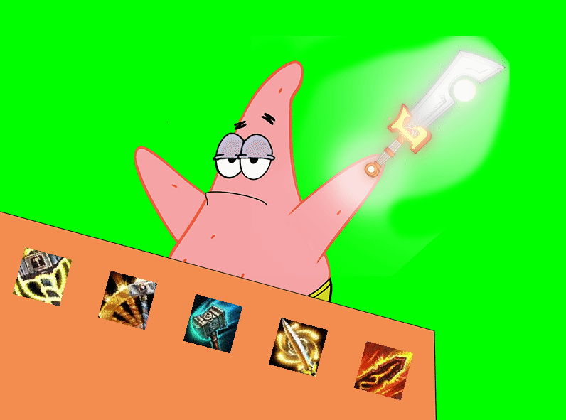

This Project uses PyGame and Pynput to capture keyboard inputs and makes a 2D Character move accordingly. This is intended to be used as a stand-in for the Inferior V-Tuber Technology on todays market.

How-To-Use:
Add your Icons (Photoshop size: 1.2cm/68x68px) to the folder and change the loading lines to the correct filenames.
Add your "Avatar" with both arms removed (336x476px) to the folder and do the same as above.
Add your "Arm" (364x339) and left "Arm" (108x141px) same as above

In the code itself, there is Idle(), which watches for your keypresses. You can change what keys it is looking for by changing these lines
if self.lastKey.char == '<YOUR NEW KEYBIND HERE>':

Let me Know if you want anything pre-made. 

Disclaimer:
The icons and characters used in this project are not my own, and I do not claim any ownership over them. All icons and characters are the sole property of their respective owners or third parties. They are used here for illustrative purposes only. Any copyrights, trademarks, or intellectual property rights pertaining to these icons and characters belong to their rightful owners.

If you are the owner of any of the icons or characters used in this project and have concerns about their usage, please contact me, and I will promptly address any issues.

This project is intended for educational or demonstrative purposes and is not associated with or endorsed by the owners of the icons and characters used.
